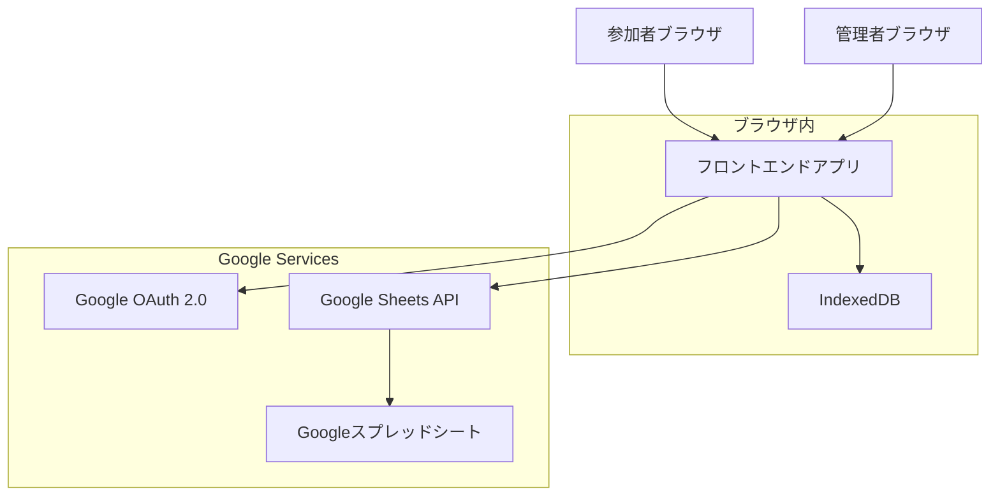
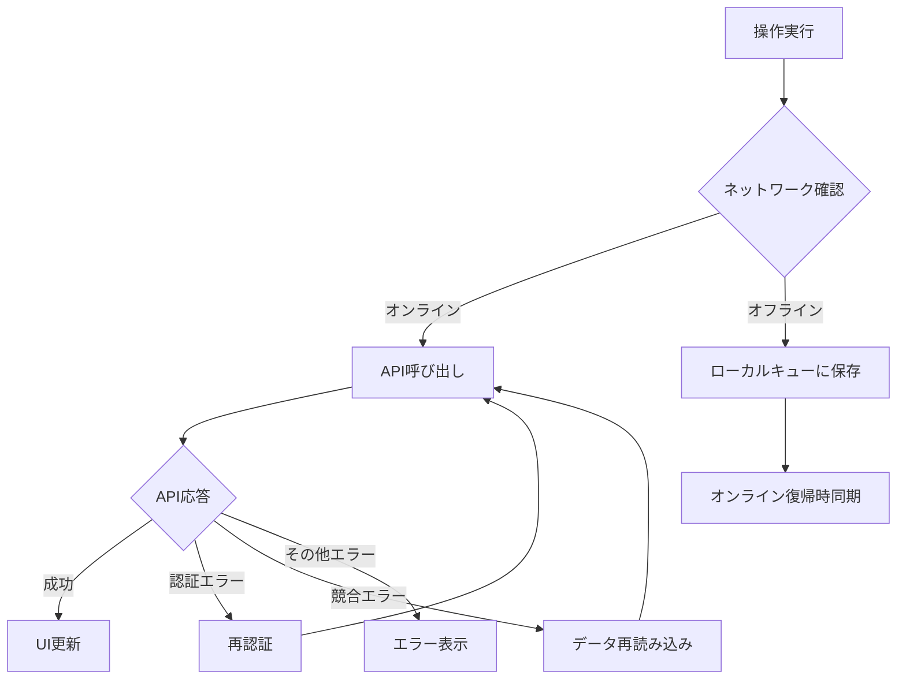
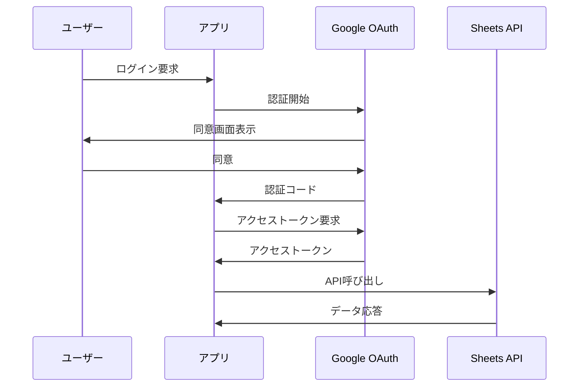

# イベント参加者管理システム 設計書

## 概要

イベント参加者管理システムは、Googleスプレッドシートを直接データソースとして使用するシングルページアプリケーション（SPA）です。参加者のセルフチェックイン機能と管理者による参加者管理機能を提供し、既存のGoogleフォーム回答シートとシームレスに統合します。

## アーキテクチャ

### システム構成



### 技術スタック

- **フロントエンド**: React 18 + TypeScript
- **状態管理**: Zustand（軽量で直感的）
- **UI フレームワーク**: Tailwind CSS + Headless UI
- **認証**: Google Identity Services (GIS)
- **API通信**: Google Sheets API v4
- **ローカルストレージ**: IndexedDB（Dexie.js）
- **ビルドツール**: Vite
- **テスト**: Vitest + React Testing Library

## コンポーネントとインターフェース

### 主要コンポーネント

#### 1. 認証コンポーネント
```typescript
interface AuthService {
  signIn(): Promise<AuthResult>
  signOut(): Promise<void>
  getCurrentUser(): User | null
  isAuthenticated(): boolean
}

interface User {
  id: string
  email: string
  name: string
  role: 'admin' | 'participant'
}
```

#### 2. Google Sheets サービス
```typescript
interface SheetsService {
  testConnection(sheetUrl: string): Promise<ConnectionResult>
  readParticipants(sheetId: string): Promise<Participant[]>
  updateParticipant(sheetId: string, participant: Participant): Promise<void>
  addSystemColumns(sheetId: string): Promise<void>
  getSheetMetadata(sheetId: string): Promise<SheetMetadata>
}

interface Participant {
  id: string
  name: string
  email?: string
  registrationTimestamp: Date
  checkinStatus: 'not_checked_in' | 'checked_in'
  checkinAt?: Date
  checkinBy?: string
  updatedAt: Date
  updatedBy: string
  auditNote?: string
}
```

#### 3. チェックインコンポーネント
```typescript
interface CheckinService {
  searchParticipant(name: string): Promise<Participant | null>
  checkinParticipant(participantId: string): Promise<void>
  undoCheckin(participantId: string): Promise<void>
  canUndo(participantId: string): boolean
}
```

#### 4. オフライン同期サービス
```typescript
interface OfflineService {
  queueOperation(operation: OfflineOperation): Promise<void>
  syncPendingOperations(): Promise<SyncResult[]>
  isOnline(): boolean
}

interface OfflineOperation {
  id: string
  type: 'checkin' | 'undo'
  participantId: string
  timestamp: Date
  data: any
}
```

### UI コンポーネント階層

```
App
├── AuthProvider
├── Router
│   ├── CheckinPage
│   │   ├── NameSearchForm
│   │   ├── ParticipantCard
│   │   └── CheckinButton
│   ├── AdminPage
│   │   ├── SheetConfigForm
│   │   ├── ParticipantList
│   │   ├── SearchFilters
│   │   └── ExportButton
│   └── LoginPage
└── OfflineIndicator
```

## データモデル

### Googleスプレッドシート構造

#### 既存列（例）
| 列名 | 型 | 説明 |
|------|------|------|
| Timestamp | 日時 | フォーム回答日時 |
| 氏名 | 文字列 | 参加者氏名（照合用） |
| メールアドレス | 文字列 | 連絡先（任意） |
| その他設問 | 各種 | フォーム固有項目 |

#### システム追加列
| 列名 | 型 | 説明 |
|------|------|------|
| _participant_id | 文字列 | 一意識別子（UUID） |
| _checkin_status | 文字列 | not_checked_in / checked_in |
| _checkin_at | 日時 | チェックイン時刻 |
| _checkin_by | 文字列 | チェックイン実行者 |
| _updated_at | 日時 | 最終更新時刻 |
| _updated_by | 文字列 | 最終更新者 |
| _audit_note | 文字列 | 監査メモ |

### ローカルデータストア（IndexedDB）

```typescript
interface LocalParticipant {
  id: string
  name: string
  email?: string
  checkinStatus: string
  lastSyncAt: Date
}

interface PendingOperation {
  id: string
  type: string
  participantId: string
  data: any
  createdAt: Date
  retryCount: number
}

interface AppConfig {
  sheetUrl: string
  sheetId: string
  nameColumnIndex: number
  lastSyncAt: Date
}
```

## エラーハンドリング

### エラー分類と対応

#### 1. 認証エラー
- **原因**: OAuth トークン期限切れ、権限不足
- **対応**: 自動再認証、権限要求画面表示

#### 2. ネットワークエラー
- **原因**: 接続断、API制限
- **対応**: 操作をキューに保存、自動リトライ

#### 3. データ競合エラー
- **原因**: 同時更新、古いデータでの更新
- **対応**: タイムスタンプ比較、再読み込み促進

#### 4. 検索エラー
- **原因**: 参加者が見つからない、複数一致
- **対応**: 明確なエラーメッセージ、検索条件の見直し提案

### エラー処理フロー



## テスト戦略

### テストレベル

#### 1. 単体テスト
- **対象**: サービスクラス、ユーティリティ関数
- **ツール**: Vitest
- **カバレッジ**: 80%以上

#### 2. 統合テスト
- **対象**: コンポーネント間連携、API統合
- **ツール**: React Testing Library
- **重点**: ユーザーフロー、エラーハンドリング

#### 3. E2Eテスト
- **対象**: 主要ユーザーシナリオ
- **ツール**: Playwright
- **シナリオ**: チェックイン、管理者操作

### テストデータ

#### モックデータ
```typescript
const mockParticipants: Participant[] = [
  {
    id: 'p1',
    name: '田中太郎',
    email: 'tanaka@example.com',
    registrationTimestamp: new Date('2024-01-01T10:00:00Z'),
    checkinStatus: 'not_checked_in',
    updatedAt: new Date(),
    updatedBy: 'system'
  }
]
```

#### テスト用スプレッドシート
- 開発環境専用のテストシートを用意
- システム列を含む完全な構造
- 各種テストケースに対応するデータセット

## セキュリティ設計

### 認証・認可

#### Google OAuth 2.0 フロー


#### 権限管理
- **最小権限の原則**: 必要最小限のスコープのみ要求
- **スコープ**: `https://www.googleapis.com/auth/spreadsheets`
- **トークン管理**: メモリ内保持、永続化禁止

### データ保護

#### プライバシー保護
- 参加者は自分の情報のみ表示
- 氏名完全一致による厳格な照合
- 他の参加者情報の漏洩防止

#### 監査ログ
- すべての更新操作を記録
- ユーザー識別、タイムスタンプ、操作内容
- 改ざん防止のためのタイムスタンプ検証

## パフォーマンス設計

### 最適化戦略

#### 1. データ読み込み
- **範囲指定読み込み**: 必要な列のみ取得
- **差分更新**: 変更された行のみ処理
- **キャッシュ戦略**: ローカルストレージでの一時保存

#### 2. UI応答性
- **仮想スクロール**: 大量データの効率的表示
- **デバウンス**: 検索入力の最適化
- **楽観的更新**: UI即座更新、バックグラウンド同期

#### 3. ネットワーク最適化
- **バッチ処理**: 複数操作の一括実行
- **リトライ機構**: 指数バックオフによる再試行
- **圧縮**: gzip圧縮の活用

### パフォーマンス目標

| 指標 | 目標値 |
|------|--------|
| 初回読み込み（5000件） | 3秒以内 |
| 検索応答時間 | 200ms以内 |
| チェックイン処理 | 1秒以内 |
| オフライン復帰同期 | 5秒以内 |

## 運用設計

### 監視・ログ

#### クライアントサイドログ
```typescript
interface LogEntry {
  timestamp: Date
  level: 'info' | 'warn' | 'error'
  category: 'auth' | 'api' | 'ui' | 'sync'
  message: string
  data?: any
}
```

#### エラー追跡
- ブラウザコンソールでのエラーログ
- 重要操作の成功/失敗記録
- パフォーマンスメトリクス収集

### 設定管理

#### 環境設定
```typescript
interface AppConfig {
  googleClientId: string
  apiKey: string
  undoTimeLimit: number // ミリ秒
  syncRetryLimit: number
  maxParticipants: number
}
```

#### 動的設定
- スプレッドシートURL
- 氏名列マッピング
- 表示項目設定

この設計により、要件定義で定義されたすべての機能を満たしながら、スケーラブルで保守性の高いシステムを構築できます。