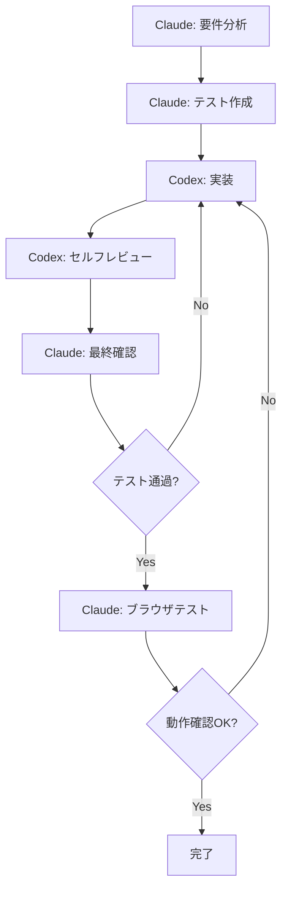

# CLAUDE.md

このファイルは、Claude Code (claude.ai/code) がこのリポジトリで作業する際のガイダンスを提供します。

## プロジェクト基本情報

イベント参加者チェックイン管理システム（Google スプレッドシート連携SPA）

**重要**: 詳細な規約とワークフローは `AGENTS.md` を参照してください。このファイルはClaude Code固有の技術詳細に特化しています。

## 開発ワークフロー（Codex連携）

### TDD実装フロー
本プロジェクトは**TDD（テスト駆動開発）**で実施します。詳細は`AGENTS.md`のテスト指針を参照。

### Claude CodeとCodexの役割分担

1. **Claude Code（私）の役割**:
   - 要件分析と設計
   - テストケースの作成（TDD Red フェーズ）
   - Codexへのタスク委託と指示
   - 実装後のレビュー結果確認と修正指示

2. **Codexの役割**:
   - テストをパスする実装（TDD Green フェーズ）
   - コードのリファクタリング（TDD Refactor フェーズ）
   - 実装後の自己レビューとテスト実行

### 実装手順



### Codex呼び出し例

```typescript
// Claude Codeがテストを作成後、Codexに実装を委託
await mcp__codex__codex({
  prompt: `
    以下のテストをパスする実装を行ってください：
    - テストファイル: src/services/sheets.test.ts
    - 実装ファイル: src/services/sheets.ts
    - TDDのGreenフェーズとして最小限の実装を行う
    実装後、pnpm run testでテストが通ることを確認してください。
  `,
  sandbox: "workspace-write",
  approval-policy: "on-failure"
})
```

### ブラウザテスト（Chrome DevTools MCP）

UI機能の実装後は、Chrome DevTools MCPを使用してブラウザ上での動作確認を行います。

#### 主要な検証項目

1. **チェックイン機能の確認**
   ```typescript
   // ページを開いて初期状態確認
   await mcp__chrome-devtools__navigate_page({
     url: "http://localhost:5173/checkin"
   })
   await mcp__chrome-devtools__take_snapshot()

   // 氏名入力と検索
   await mcp__chrome-devtools__fill({
     uid: "name-input",
     value: "田中太郎"
   })
   await mcp__chrome-devtools__click({
     uid: "search-button"
   })

   // チェックイン実行
   await mcp__chrome-devtools__click({
     uid: "checkin-button"
   })
   await mcp__chrome-devtools__take_screenshot({
     fullPage: true
   })
   ```

2. **オフライン動作の検証**
   ```typescript
   // オフライン状態をエミュレート
   await mcp__chrome-devtools__emulate_network({
     throttlingOption: "Offline"
   })

   // オフライン時の動作確認
   await mcp__chrome-devtools__click({
     uid: "checkin-button"
   })

   // オンライン復帰と同期確認
   await mcp__chrome-devtools__emulate_network({
     throttlingOption: "No emulation"
   })
   ```

3. **パフォーマンステスト**
   ```typescript
   // パフォーマンストレース開始
   await mcp__chrome-devtools__performance_start_trace({
     reload: true,
     autoStop: true
   })

   // 大量データでの動作確認（5000件）
   await mcp__chrome-devtools__navigate_page({
     url: "http://localhost:5173/admin"
   })

   // トレース停止と分析
   await mcp__chrome-devtools__performance_stop_trace()
   ```

#### エラー監視
```typescript
// コンソールメッセージの取得
const messages = await mcp__chrome-devtools__list_console_messages({
  types: ["error", "warn"]
})

// ネットワークエラーの確認
const requests = await mcp__chrome-devtools__list_network_requests({
  resourceTypes: ["xhr", "fetch"]
})
```

## 技術アーキテクチャ

### コア技術スタック（.kiro/specs/event-participant-management/design.md より）
- **React 18 + TypeScript** (Vite ビルド)
- **Zustand** (状態管理)
- **Tailwind CSS + Headless UI** (UI)
- **Google Identity Services** (認証)
- **Google Sheets API v4** (データストア)
- **Dexie.js** (IndexedDB ラッパー)
- **Vitest + React Testing Library** (テスト)

## 主要インターフェース定義

### コアデータ型（設計書より抜粋）

```typescript
interface Participant {
  id: string
  name: string
  email?: string
  registrationTimestamp: Date
  checkinStatus: 'not_checked_in' | 'checked_in'
  checkinAt?: Date
  checkinBy?: string
  updatedAt: Date
  updatedBy: string
  auditNote?: string
}

interface OfflineOperation {
  id: string
  type: 'checkin' | 'undo'
  participantId: string
  timestamp: Date
  data: any
}

interface SheetsService {
  testConnection(sheetUrl: string): Promise<ConnectionResult>
  readParticipants(sheetId: string): Promise<Participant[]>
  updateParticipant(sheetId: string, participant: Participant): Promise<void>
  addSystemColumns(sheetId: string): Promise<void>
}

interface CheckinService {
  searchParticipant(name: string): Promise<Participant | null>
  checkinParticipant(participantId: string): Promise<void>
  undoCheckin(participantId: string): Promise<void>
  canUndo(participantId: string): boolean
}
```

## Google Sheets API 統合詳細

### システム列仕様
```
_participant_id    # UUID v4
_checkin_status    # ENUM: not_checked_in | checked_in
_checkin_at        # ISO 8601 timestamp
_checkin_by        # ユーザーメール
_updated_at        # 競合検出用タイムスタンプ
_updated_by        # 最終更新者
_audit_note        # 操作メモ（Undo理由など）
```

### API呼び出しパターン
- **接続テスト**: spreadsheets.get() でメタデータ取得
- **データ読み込み**: spreadsheets.values.batchGet() で範囲指定
- **チェックイン更新**: spreadsheets.values.update() で単一行更新
- **競合検出**: _updated_at カラムで楽観的ロック

### エラーリトライ戦略
```typescript
// 指数バックオフの実装例
const retryWithBackoff = async (fn, maxRetries = 3) => {
  for (let i = 0; i < maxRetries; i++) {
    try {
      return await fn()
    } catch (error) {
      if (i === maxRetries - 1) throw error
      await new Promise(r => setTimeout(r, Math.pow(2, i) * 1000))
    }
  }
}
```

## IndexedDB スキーマ（Dexie.js）

```typescript
const db = new Dexie('EventCheckinDB')
db.version(1).stores({
  participants: 'id, name, email, checkinStatus',
  pendingOperations: '++id, participantId, createdAt',
  config: 'key'
})
```

## パフォーマンス最適化のポイント

1. **仮想スクロール**: 5000件対応は react-window 使用
2. **検索デバウンス**: 300ms遅延で API コール削減
3. **差分更新**: React.memo と useMemo で再レンダリング最小化
4. **バッチ読み込み**: spreadsheets.values.batchGet() で複数範囲を一括取得

## 実装時の頻出パターン

### オフライン検出とキューイング
```typescript
if (!navigator.onLine) {
  await db.pendingOperations.add(operation)
  // UI は楽観的更新
  return
}
```

### 氏名完全一致検索
```typescript
// 前後の空白を除去して完全一致
const normalizedInput = input.trim()
const match = participants.find(p =>
  p.name.trim() === normalizedInput
)
```

## 重要な参照先

- **仕様**: `.kiro/specs/event-participant-management/` ディレクトリ
- **規約**: `AGENTS.md` (コーディング規約、ワークフロー)
- **要件**: `requirements.md` (機能仕様の最新ソース)